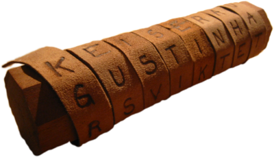
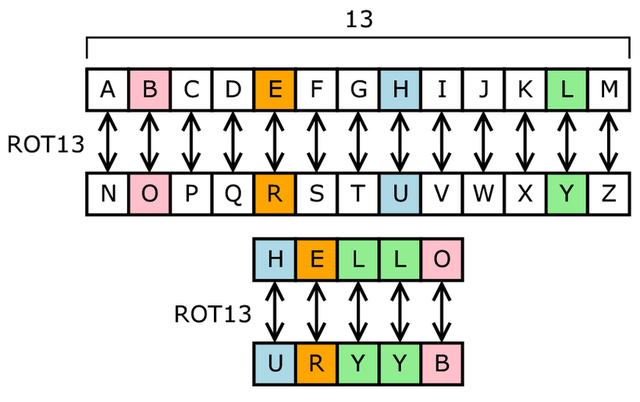

## Cryptography

Cryptography = Secrets


Photo by [Sai De Silva](https://unsplash.com/@scoutthecity?utm_source=unsplash&amp;utm_medium=referral&amp;utm_content=creditCopyText) on [Unsplash](https://unsplash.com/s/photos/secret?utm_source=unsplash&amp;utm_medium=referral&amp;utm_content=creditCopyText)

---

## Cryptography Continued

</br>

Cryptography is about **secrets!**

</br>

- Helps you communicate confidentially
- Nations and Militaries used to use it
- Today people use it via browsers and servers

Note:
Now each of our browsers and servers are doing thousands of encryptions/decryptions a day.

---

## Scytale (500-401 BC)



"I am hurt very badly help" -> "Iryyatbhmvaehedlurlp"

```
       | I | a | m | h | u |  |
     __| r | t | v | e | r |__|
    |  | y | b | a | d | l |
    |  | y | h | e | l | p |
```

Image/example from [wikipedia](https://en.wikipedia.org/wiki/Scytale)

Note:
Apparently when the Spartan's weren't kicking people into pit's and yelling this is Sparta they were working on some pretty neat cryptography.
It's believe they may have use this device to encrypt and decrypt messages. Two cylinders/skytales with identical diameters would have to be used.
One would wrap a piece of leather around the cylinder and then you would write out your message. Then once you unwrapped the leather it was essentially
encoded since the leather didn't make sense without decryption. The recipient would use their skytale to quickly decrypt the message. So a couple
interesting things to note are that nothing in the original message changed. This message has simply been shuffled this is referred to as transposition cipher.
For those quick to notice patterns will realize that essentially this is taking every fifth letter/character.

---

## Caesar Cipher (100-44BC)

ROT1

| Encrypt | Decrypt |
|---------|---------|
| A -> B  | B -> A  |
| B -> C  | C -> B  |
| C -> D  | D -> C  |
| T -> U  | U -> T  |

So CAT -> DBU -> CAT

Note:
If you have ever heard of a cipher or made one this one is likely it. This involves remapping letters by rotating the alphabet by a certain number of letters.
This is what is referred to as substitution cipher since your substituting notice unlike the previous it's possible none of the original message still exists.

---

## ROT13 Caesar Cipher





Image/example from [wikipedia](https://en.wikipedia.org/wiki/ROT13)

Note:
The most popular version is ROT13 which rotates the letters by 13. The advantage of this is that since the alphabet is 26 letters the same algorithm/table can be used to encrypt and decrypt.
These algorithms are very easy to break and should not be used for anything that really needs to be kept secret. However, they are useful for an easy introduction into encryption.
Historians believe at the time they were unbreakable.

---

## Notable Events</br></br>

- Al-Kindi, an Arab Mathematician develops frequency analysis(800)</br></br>
- British Intelligence intercepts and decodes Zimmermann Telegram(1917)</br></br>
- Alan Turing develops a machine(Bombe) to decrypt Enigma(1939-1943)</br></br>

Note:
There was continuous developments in cryptography however I want to just focus on the core concepts which were captured by the easier to understand examples.
However, I will just briefly describe some of the other events.
Frequency analysis provides valuable insights into breaking ciphers.
Decoding the Zimmermann Telegram helped to shape American public opinion during WW1 motivitating the US to enter.
Some historians that breaking the Enigma code shortened the war in Europe by as many as two to four years.(https://www.bbc.com/news/technology-18419691)

---

## Modern Cryptography
- [Data Encryption Standard(DES)](https://csrc.nist.gov/csrc/media/publications/fips/46/3/archive/1999-10-25/documents/fips46-3.pdf) 1977 - unclassified, sensitive information
- [Advanced Encryption Standard(AES)](https://csrc.nist.gov/csrc/media/publications/fips/197/final/documents/fips-197.pdf) 2001 - Current standard globally for transferring sensitive information
- [Simplified AES](https://www.ime.usp.br/~rt/cranalysis/AESSimplified.pdf) - Variant used for learning

Note: Until the 1960s cryptography was really primarily used by government and more specifically their military.
However, with the advent of the Internet and the need for communicating securely cryptography entered the public domain.

---

## Computing Details

- data = numbers
- spreadsheets, images, videos, letters = numbers
- For example 
  - Z = 90 = 0x5A
  - 2 = 50 = 0x32
  - White = 255, 255, 255
- Hex = 0,1,2,3,4,5,6,7,8,9,A,B,C,D,E,F
  - A = 10
  - F = 16

Note:
Go over numbers and hex. Hex is nice way to represent machine values since they are 16 is a base 2 number.
This means mathematicians can work with these numbers and encrypt anything.

---

## AES Encryption Example

1. Convert 'passwordpassword' to bytes
1. https://cryptii.com/
1. Encrypt 'super secret message' to AES bytes
1. https://cryptii.com/pipes/aes-encryption

---

## AES Exercise

- **AES-128 CBC Encoded Bytes:**
4c 6b 54 45 f3 e6 88 f9 c5 56 c9 e4 5c b0 68 92
- **Key(text):**
passwordpassword
- **IV:**
00 01 02 03 04 05 06 07 08 09 0a 0b 0c 0d 0e 0f

- https://cryptii.com/
- https://cryptii.com/pipes/aes-encryption

```
echo -n "00000000: 4c6b 5445 f3e6 88f9 c556 c9e4 5cb0 6892" | xxd -r > encrypted_data
echo -n "passwordpassword" | xxd -p
openssl enc -aes-128-cbc -d -in <encrypted_data> -K <key> -iv <iv>
```

---

## Hacker in the Network (Recap)

</br>
</br>
👩‍💻 -------✉️🦹-------> 🏦

</br>
</br>

🦹📩 = 💸

Note: You may have forgotten about our main goal, but I didn't. So last we left off off in our example the hacker was getting our message just by listening to messages on the wire.
Well, now we have the power of cryptography so let's show the hacker how it's done.

---

## Sending key with message 

</br>
</br>
👩‍💻 -------🔑🔒🦹-------> 🏦

</br>
</br>

🦹🔑🔒= 📩
</br>
</br>
🦹📩 = 💸

Note: I know this is silly, but I just want to make it clear that just encrypting data doesn't make it protected.
Protecting your key is critical just like protecting the key to your house. So in this situation we sent the key
over the wire and now the hacker can simply take the encrypted message(lock) and the key and decrypt the message.
The hacker wins again....

---

## Pre Shared Key

</br>
</br>
👩🔑 <--> 🔑🏦
</br>
</br>
👩‍💻🔑 -------🔒🦹-------> 🔑🏦

</br>
</br>
🦹 = 😞

Note: Ah we wised up after losing an unmentioned amount of money. We are actually going to physically go to the bank and
exchange our key so we can then use that key to encrypt messages which the bank will be able to decrypt. Now this will
work, but there are some drawbacks we had to go to the back to exchange keys and if the key is comprimised we will have
to go exchange keys again.

Huzzah our first win!!!

---

## Asymmetric Encryption

- Symmetric Encryption = 1 key used by both parties

👨🔑 <-----🔒------> 🔑👨

- Asymmetric Encryption = 2 different keys

👨🗝️  -----🔒------> 🔑👨

 🗝️ = encrypt 🔑 = decrypt

- [RSA](https://people.csail.mit.edu/rivest/Rsapaper.pdf) 1977 - Public Key Cryptography / Strong Encryption

Note: So far we have primarily discussed what is now called symmetric encryption where the keys for encrypting and decrypting are the same.


---

## Asymmetric Encryption Cont

> Public key cryptography is a magical gift from mathematics to computer science
>   [everything-pki](https://smallstep.com/blog/everything-pki/)

| Encrypt        	| Decrypt         	|
|----------------	|-----------------	|
| message = 5    	| encrypted = 10  	|
| encrypt = +    	| decrypt = /     	|
| public key = 5 	| private key = 2 	|
| encrypted = 10 	| message = 5     	|

Note: So while researching cryptography and pki I came across this quote I really liked.
So why is this whole public key cryptography the best thing since sliced bread. I'm going to try to explain
but, it's hard. Some of the magic lies in the complexity. Anyhow as you remember all things are numbers.
So we are just going to work with simple numbers. Imagine the plus operation is not easily reversed. In actual RSA you
would need to have quantum computer to reverse the process in a reasonable amount of time.

---

## Asymmetric Encryption

</br>
</br>
👩‍💻🗝️ <------------------------ 🏦
</br>
</br>
👩‍💻🗝️  -------🔒🦹-------> 🔑🏦

</br>
</br>
🗝️ = public key
</br>
🔑 = private key

</br>
</br>

🦹 = 😞

---

## Hacker's new tricks

</br>
</br>
👩‍💻🗝️ <------------------------ 🦹🏦
</br>
</br>
👩‍💻🗝️  -------🔒🔑🦹🗝️-------> 🔑🏦

</br>
</br>
🗝️ = public key
</br>
🔑 = private key

</br>
</br>

🦹🔑🔒= 📩
</br>
</br>
🦹📩 = 💸
