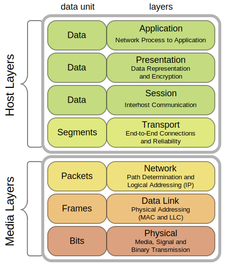

## **Cryptography &   Digital Signatures**
Kavi Jivan

---
## Overview

 

### Problem

Secure Internet Communication
 
Secure = Confidential and Integral(Verified Recipient)

 

#### Solution
- Simple -> Complex
- Past -> Present
- Physical -> Digital

Note:
Originally I was going to do the presentation with a greater focus on history and time line.
However, while working on the presentation I thought it would be better to focus on solving the fundamental problem that cryptography and signatures try to solve.
That fundamental problem being secure Internet communication! For the purposes of this presentation I'm calling secure confidential meaning only you and recipient understand
and verified as in the identity of the person on the other end of the connection. That message is ending up with the right person.
But we are still going to keep some history in there since I want to do a bottom-up building of network security. So we will be working from simple to more complex. This also tends to mean from the past to present
and physical to digital.

---
## Internet

Internet = Connectivity and Communication

Photo by [NASA](https://unsplash.com/@nasa?utm_source=unsplash&utm_medium=referral&utm_content=creditCopyText) on [Unsplash](https://unsplash.com/s/photos/internet?utm_source=unsplash&utm_medium=referral&utm_content=creditCopyText)

<!-- HTML comment recognizes as a presenter note per pages. -->
<!-- You may place multiple comments in a single page. -->

Note:
Fundamentally the internet is two things the physical connections between devices and the protocols that allow devices to understand each other.
This allows us and our devices to all communicate with one other.

---

## Plain Message over the Internet

 
 
👩‍💻 --------✉️-------> 🏦

Note:
This is the simplest understanding of the web we can get where we simply send messages from one place to another. In this example from a client of a bank to the bank's website.
This women behind the laptop is logging onto her bank's website with her password to pay a bill.

---

## Hacker in the Network

 
 
👩‍💻 -------✉️🦹-------> 🏦

 
 

🦹📩 = 💸

Note:
So this is where it gets more interesting.  The internet is connected through a network which means it's not going directly from point to point. 
It's actually hitting other machines on the way to it's destination and the connection could also be shared.
WiFi is a notorious example of this since WiFi generally not  point to point. We don't typically restrict radio waves and so anyone can listen in 
on those connections.

---
## Internet Stack

--

Image from [wikipedia](https://en.wikipedia.org/wiki/Protocol_stack)
