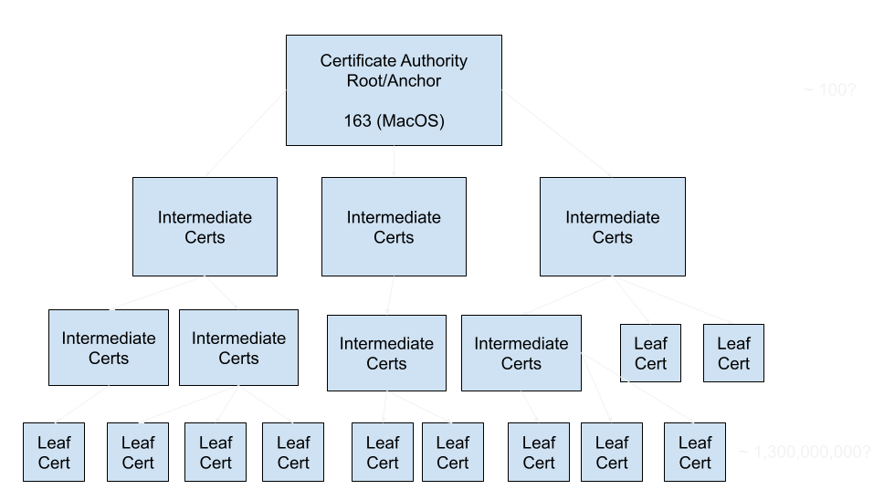

## **Signatures & Certificates**

</br>

Kavi Jivan

---

## Problem

</br>
Secure Internet Communication
</br>
</br>

* Secure = Confidential and Integral(Verified Recipient)
</br>
</br>
* Confidential = Cryptography
* Integral(Verified) = Signatures (Cryptography)

</br>
</br>

---

## Hacker in the Network

</br>
</br>
👩‍💻 -------✉️🦹-------> 🏦

</br>
</br>

🦹📩 = 💸

---

## Sending key with message 

</br>
</br>
👩‍💻 -------🔑🔒🦹-------> 🏦

</br>
</br>

🦹🔑🔒= 📩
</br>
</br>
🦹📩 = 💸

---

## Menti Question 1

---
## Asymmetric Encryption

</br>
</br>
👩‍💻🗝️ <------------------------ 🏦
</br>
</br>
👩‍💻🗝️  -------🔒🦹-------> 🔑🏦

</br>
</br>
🗝️ = public key
</br>
🔑 = private key

</br>
</br>

🦹 = 😞

---

## Asymmetric Encryption with key Exchange

👩‍💻🗝️ <--------------------------- 🏦
</br>
👩‍💻🔩  ---------🔒🔩--------> 🔑🏦
</br>
👩‍💻🔩 <---------------------> 🔩🏦

</br>
🗝️ = public key
</br>
🔑 = private key
</br>
🔩 = symmetric key
</br>
🔒🔩 = encrypted symmetric key

---

## Asymmetric Encryption Key Exchange with Hacker

</br>
👩‍💻🗝️ <------------🔑🦹🗝️-------------🔑🏦
</br>
👩‍💻🔩  -------🔒🔩🦹-------> 🔑🏦
</br>

</br>
🗝️ = public key
</br>
🔑 = private key
</br>
🔩 = symmetric key
</br>
🔒🔩 = encrypted symmetric key

---

## Signatures

</br>

- Signatures Verify Identity
- Signatures Endorse Something

</br>


Photo by [Lewis Keegan](https://unsplash.com/@skillscouter?utm_source=unsplash&utm_medium=referral&utm_content=creditCopyText) on [Unsplash](https://unsplash.com/s/photos/signature?utm_source=unsplash&utm_medium=referral&utm_content=creditCopyText)

---

## History of Signatures

</br>

- 3000BC-Present - Seals

- 1677 - State of Frauds Act

- 1776 - John Hancock

- 2000 - Electronic Signatures Act


---

## Signatures Properties

</br>

- Anyone can verify
- Only correct person can create

</br>
</br>

One Way Transaction

- Symmetric = 2 way
- Asymmetric = 1 way


---

## Asymmetric Revisted


Encryption
- Public Key - Anyone can encrypt
- Private Key - Only correct person can decrypt

</br>
</br>

Signatures
- Public Key - Anyone can decrypt
- Private Key - Only correct person can encrypt

---
## Signatures

How do digital signatures work?

- Inventory PDF needs to be signed
- Complete filling out the PDF
- Hash the PDF
- hash = shorter string that represents the whole document
- Encrypt hash using PIV private key
- Attach encrypted hash to document

---
## Verify Identity

</br>
</br>
👩‍💻🗝️ <------------------------ 🏦
</br>
</br>
👩‍💻🗝️ <---------🔏---------🔑🏦
</br>
</br>
👩‍💻 --------------------------☑️🏦
</br>
</br>

- 🗝️ = public key
- 🔑 = private key
- 🔏 = message signed with private key

---

## Hacker Pretender

</br>
</br>
👩‍💻🗝️ <------------------------ 🦹🏦
</br>
</br>
👩‍💻🗝️ <---------🔏🦹---------🔑🏦
</br>
</br>
👩‍💻 ---------------☑️🦹-----------🏦
</br>
</br>

- 🗝️ = public key
- 🔑 = private key
- 🔏 = message signed with private key

---

## How do you establish trust?

- Get every websites' public key before hand
- Not Scalable
- You would need 1.3 Billion keys
- Expiration issues
- Use a smaller set of public keys to verify signatures

---

## Starting Point of Trust

- You have to trust something as a starting point
- Lacking a trust anchor creates a recursive issue

</br>
</br>

- Say Kevin asks to loan money
- Alice vouches for Kevin but we don't know Alice
- Bill vouches for Alice and we trust Bill

---

## Certificates

Actually Contain two things
- Public Key
  - encrypt keys for key exchange
  - verify signatures
- Signature

- Root Certs are self-signed nothing else can vouch for them

---
## Trust Chain



---

## Menti Question 2

---
## Public Key Infrastructure(PKI)

</br>
</br>

- Composed of Certificates
- Trust Root Certificates
- Installed with your system or browser
- All other certificates signatures are verified
- Typically used with Secure Socket Layer(SSL)

---

## Demo Certificates

Go to the browser and inspect google certificates

CLI
```
openssl s_client -connect google.com:443 2>&1 < /dev/null
```

---

## Java Application Cert Error

- PKIX path building failed: sun.security.provider.certpath.SunCertPathBuilderException: unable to find valid certification path to requested target

</br>
</br>

1. Find jdk and inspect cacerts/truststore
2. Use keytool to add CA Cert

</br>
</br>

---

## Browser failing to connect to site

May need to add a cert to your system trust store
- Keychain in MacOS
- Cert Manager in Windows
- Browser or other in Linux

---

## Possible Cert Issues

- Server Side
  - Wrong Cert (self-signed cert?)
  - Expired Cert
  - Revoked Cert
  - Missing intermediate certs
- Client Side
  - Missing Root Cert
  - Root Cert Expired


---

## References

- Keytool Reference
- https://gist.github.com/kjivan/c0acb5b5e6f7c01692ac4cef9bb74b32
- OpenSSL Reference
- https://gist.github.com/kjivan/7cb253cc08687b4daf6d2d66406b572a

