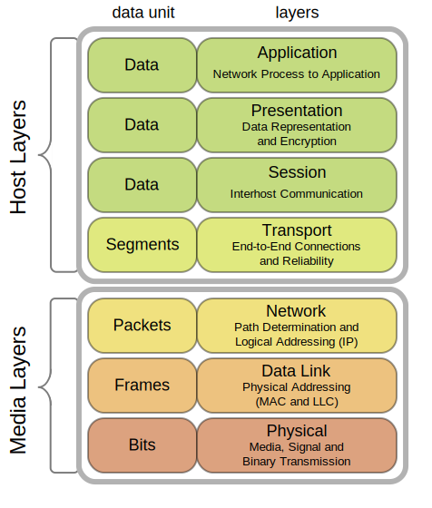

## **Cryptography & </br> Digital Signatures**
Kavi Jivan

---
## Overview

</br>

### Problem

Secure Internet Communication
</br>
Secure = Secret and Verified

</br>

#### Solution
- Simple -> Complex
- Past -> Present
- Physical -> Digital

Note:
Originally I was going to do the presentation with a greater focus on history and time line.
However, while working on the presentation I thought it would be better to focus on solving the fundamental problem that cryptography and signatures try to solve.
That fundamental problem being secure Internet communication! For the purposes of this presentation I'm calling secure secret or private and verified as in the identity of the person on the other end of the connection.
But we are still going to keep some history in there since I want to do a bottom-up building of network security. So we will be working from simple to more complex. This also tends to mean from the past to present
and physical to digital.

---
## Internet

Internet = Connectivity and Communication


Photo by [NASA](https://unsplash.com/@nasa?utm_source=unsplash&utm_medium=referral&utm_content=creditCopyText) on [Unsplash](https://unsplash.com/s/photos/internet?utm_source=unsplash&utm_medium=referral&utm_content=creditCopyText)

<!-- HTML comment recognizes as a presenter note per pages. -->
<!-- You may place multiple comments in a single page. -->

Note:
Fundamentally the internet is two things the physical connections between devices and the protocols that allow devices to understand each other.
This allows us and our devices to all communicate with one other.

---

## Plain Message over the Internet

</br>
</br>
👩‍💻 --------✉️-------> 🏦

Note:
This is the simplest understanding of the web we can get where we simply send messages from one place to another. In this example from a client of a bank to the bank's website.
This women behind the laptop is logging onto her bank's website with her password to pay a bill.

---

## Hacker in the Network

</br>
</br>
👩‍💻 -------✉️🦹-------> 🏦

</br>
</br>

🦹📩 = 💸

Note:
So this is where it gets more interesting.  The internet is connected through a network which means it's not going directly from point to point. 
It's actually hitting other machines on the way to it's destination and the connection could also be shared.
WiFi is a notorious example of this since WiFi generally not  point to point. We don't typically restrict radio waves and so anyone can listen in 
on those connections.

---
## Internet Protocol



--

Image from [wikipedia](https://en.wikipedia.org/wiki/Protocol_stack)

---

## Cryptography

Cryptography = Secrets


Photo by [Sai De Silva](https://unsplash.com/@scoutthecity?utm_source=unsplash&amp;utm_medium=referral&amp;utm_content=creditCopyText) on [Unsplash](https://unsplash.com/s/photos/secret?utm_source=unsplash&amp;utm_medium=referral&amp;utm_content=creditCopyText)

---

## Cryptography Continued

</br></br>
Cryptography is about secrets. It helps you communicate something that only you and the party that recieves it understands.
</br></br>
In the past this might have been military information. Today we want to keep our bank passwords a secret so people don't steal all our money.
</br>

Note:
So, today each of our browsers and servers are doing thousands of encryptions/decryptions a day.

---

## Scytale (500-401 BC)


"I am hurt very badly help" -> "Iryyatbhmvaehedlurlp"

```
       | I | a | m | h | u |  |
     __| r | t | v | e | r |__|
    |  | y | b | a | d | l |
    |  | y | h | e | l | p |
```

Image/example from [wikipedia](https://en.wikipedia.org/wiki/Scytale)

Note:
Apparently when the Spartan's weren't kicking people into pit's and yelling this is Sparta they were working on some pretty neat cryptography.
It's believe they may have use this device to encrypt and decrypt messages. Two cylinders/skytales with identical diameters would have to be used.
One would wrap a piece of leather around the cylinder and then you would write out your message. Then once you unwrapped the leather it was essentially
encoded since the leather didn't make sense without decryption. The recipient would use their skytale to quickly decrypt the message. So a couple
interesting things to note are that nothing in the original message changed. This message has simply been shuffled this is referred to as transposition cipher.
For those quick to notice patterns will realize that essentially this is taking every fifth letter/character.

---

## Caesar Cipher (100-44BC)

ROT1

| Encrypt | Decrypt |
|---------|---------|
| A -> B  | B -> A  |
| B -> C  | C -> B  |
| C -> D  | D -> C  |
| T -> U  | U -> T  |

So CAT -> DBU -> CAT

Note:
If you have ever heard of a cipher or made one this one is likely it. This involves remapping letters by rotating the alphabet by a certain number of letters.
This is what is referred to as substitution cipher since your substituting notice unlike the previous it's possible none of the original message still exists.

---

## ROT13 Caesar Cipher


Image/example from [wikipedia](https://en.wikipedia.org/wiki/Scytale)

Note:
The most popular version is ROT13 which rotates the letters by 13. The advantage of this is that since the alphabet is 26 letters the same algorithm/table can be used to encrypt and decrypt.
These algorithms are very easy to break and should not be used for anything that really needs to be kept secret. However, they are useful for an easy introduction into encryption.
Historians believe at the time they were unbreakable.


---

## Notable Events</br></br>

- Al-Kindi, an Arab Mathematician develops frequency analysis(800)</br></br>
- British Intelligence intercepts and decodes Zimmermann Telegram(1917)</br></br>
- Alan Turing develops a machine(Bombe) to decrypt Enigma(1939-1943)</br></br>

Note:
There was continuous developments in cryptography however I want to just focus on the core concepts which were captured by the easier to understand examples.
However, I will just briefly describe some of the other events.
Frequency analysis provides valuable insights into breaking ciphers.
Decoding the Zimmermann Telegram helped to shape American public opinion during WW1 motivitating the US to enter.
Some historians that breaking the Enigma code shortened the war in Europe by as many as two to four years.(https://www.bbc.com/news/technology-18419691)

---

## Modern Cryptography
- Data Encryption Standard(DES) 1977 - unclassified, sensitive information
- Advanced Encryption Standard (AES) 2001 - Current standard globally for transferring sensitive information
- [Simplified AES](https://www.ime.usp.br/~rt/cranalysis/AESSimplified.pdf) - Variant used for learning
